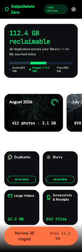
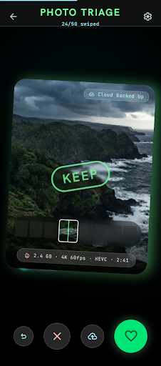
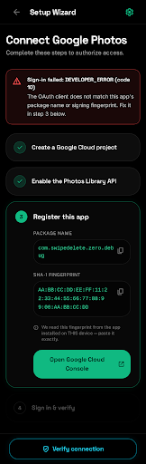
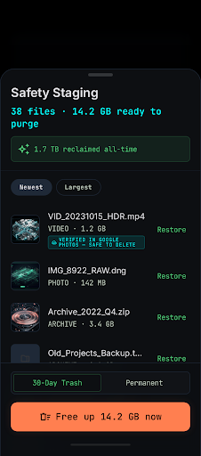

# Design reference — v3.1

Reference screens generated with **Google Stitch** against a design system built
from the app's existing OLED tokens (`#000000` canvas, `#00E676` emerald,
`#00F0FF` cyan, `#FFD700` gold, `#FF3B30` coral, 28dp radii, dark, vibrant).
They are targets for the Compose implementation, not shipped assets.

| Screen | Reference |
|---|---|
| Dashboard |  |
| Swipe deck |  |
| Connect wizard |  |
| Safety staging |  |

## What the redesign changed, and why

Each change below came from a defect visible in real-device screenshots, not
from taste alone.

**One honest headline.** The hero previously summed every deck's bytes. Because
a single large video simultaneously belongs to its month deck, Heavy Hitters and
Large Videos, the same bytes were counted repeatedly — a real device reported
"up to 804.8 GB" reclaimable while holding only 430.7 GB of used space. The
headline is now computed once per scan over cleanup candidates de-duplicated by
content URI (`DeckBuilder.ScanResult.candidateBytes`), Time Machine excluded
because it contains the whole library by construction, and clamped to used
space as a final sanity rail.

**Months, not parts.** Decks are capped at 50 cards to keep sessions snackable,
but the dashboard listed every chunk, so one phone showed 526 "Cleanup Sprints"
and 524 "More Decks". `DeckGroup` aggregates parts sharing a `groupId`, so the
dashboard shows "August 2026" once — with progress summed across its parts, and
"continue" resuming at the first unfinished one — while swipe sessions stay ≤50.

**Two matcher bugs behind the deck explosion.** The Camera Bursts hotspot
matched `dcim/camera`, i.e. the entire camera roll, re-chunking the whole
library under a misleading label. And Heavy Hitters' predicate
`isVideo && a || b` collapsed to "any file ≥ 40 MB" under Kotlin's precedence
rules, making the 100 MB video threshold dead code.

**"Not scanned yet" ≠ "All clean".** Duplicate and blur detection only ran under
`charging + device-idle` daily work, so on a fresh install it had never run and
both buckets showed "All clean" over a 400 GB library. Those tiles now offer
**Scan now**, which runs the same worker expedited and without constraints, then
rebuilds the affected decks.

**Real insets.** The dashboard reserved a fixed `120.dp` bottom padding, so the
last bucket row hid behind the gesture bar; it now adds the actual
`navigationBars` inset. Settings had no bottom inset at all, and its empty state
stretched inside a `weight(1f)` box that stranded the text mid-screen.

**One query, not N.** Merging saved progress ran one Room lookup per deck —
over a thousand sequential queries per dashboard load, paid again on every deck
open. It is now a single `getAll()` joined in memory.

## Connect wizard

The wizard exists because `Sign-in failed (code 10)` is unactionable and the
usual advice — copy a fingerprint out of a setup document — is wrong whenever
the installed APK was signed with a different key than the document assumed.

- `SigningIdentityReader` reads the **installed** APK's certificate via
  `PackageManager.GET_SIGNING_CERTIFICATES` and renders a colon-separated SHA-1.
  It cannot drift from what Google actually sees, and needs no keytool.
- `AuthDiagnostic.decode` maps every reachable Google status code to a cause, a
  fix, and the wizard step that resolves it; a failure auto-expands that step.
- Each step deep-links to the exact Google Cloud Console page.
- **Verify connection** makes a real Drive API call and confirms the Photos
  scope was granted, so success is proven rather than assumed. It never
  uploads — a probe must not create content in someone's library.
